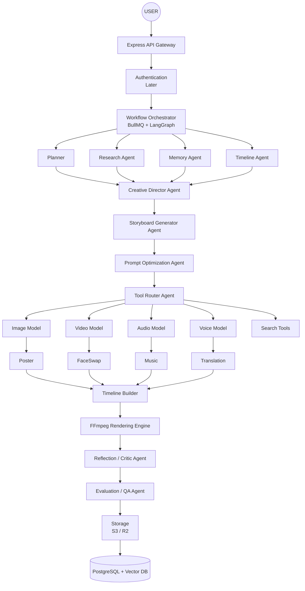

# VideoCraft (Applied AI Roadmap)

This roadmap is designed for building a real startup focusing on AI orchestration, agent systems, multimodal generation, and production-ready AI. The frontend is intentionally postponed to focus on backend execution capabilities.

## Final Architecture

## Technology Stack

### Backend
- Node.js
- TypeScript
- Express.js
- Zod
- Prisma
- PostgreSQL

### Queue
- RabbitMQ (or Kafka later)

### AI
- LiteLLM (One interface for OpenAI, Anthropic, Gemini, etc.)
- OpenAI / Anthropic / Gemini
- **Agent Framework**: LangGraph ⭐⭐⭐⭐⭐
- LangChain (only where useful)
- MCP (Model Context Protocol)

### Memory
- PostgreSQL
- pgvector
- Embeddings

### Media
- FFmpeg
- FaceFusion
- Whisper
- ElevenLabs
- Suno / Udio / MusicGen
- Image & Video generation providers

### Storage
- Cloudflare R2
- AWS S3

### Infrastructure
- Docker
- Docker Compose
- **Later**: Kubernetes, Kafka, Prometheus, Grafana, OpenTelemetry

---

## Roadmap

### Version 0 — AI Infrastructure
**Goal:** Backend capable of handling long-running AI jobs.

**Learn:**
- **Backend:** Express, REST APIs, TypeScript, Middleware
- **Database:** PostgreSQL, Prisma, Transactions
- **Queue:** Redis, BullMQ, Workers
- **Infrastructure:** Docker, Object Storage
- **Concepts:** Retry, Idempotency, Background Jobs, File Uploads, Logging

**Build:**
Client -> POST Job -> BullMQ -> Worker -> Storage -> Done

**Tech:** Express, TypeScript, Redis, BullMQ, Prisma, Postgres, Docker, R2

**Test:**
- Upload image
- Create job
- Queue executes
- Worker completes
- Status API updates correctly

### Version 1 — Planning AI
**Goal:** AI understands user intent.

**Learn:** Prompt Engineering, Context Engineering, Structured Outputs, JSON Schema

**Tech:** LiteLLM, OpenAI, Anthropic, Gemini, Zod

**Build:**
Planner Agent -> Output JSON Plan

**Test:** Try 100 different prompts. The planner should always produce valid structured plans.

### Version 2 — Workflow Engine
**Goal:** Replace if/else with agent workflows and stream execution to the user.

**Learn:** LangGraph, State Machines, DAG, Graphs, Agent State, Server-Sent Events (SSE), WebSockets, Real-time Streaming

**Tech:** LangGraph, BullMQ, LiteLLM, SSE

**Build:**
Planner -> Storyboard -> Prompt Optimizer -> Tool Router
*Real-time Event Stream*: Stream AI execution steps, thought process, and intermediate logs to the frontend UI as they happen.

**Test:** Different requests should follow different execution paths automatically. The UI should display a live, real-time stream of what the AI is thinking and doing at each node.

### Version 3 — Tool Calling
**Goal:** AI decides which tools to use.

**Learn:** Tool Calling, Function Calling, MCP, Dynamic Routing

**Tech:** LangChain Tools, MCP, LiteLLM

**Build Tools:**
Video, Image, Poster, Voice, Music, Face Swap, Website Reader, PDF Reader

**Test:** Ask for different specific content types (Poster, Video, Audio, Mixed). The AI should invoke only the required tools.

### Version 4 — Video Generation
**Goal:** Generate long videos.

**Learn:** Scene Planning, Storyboards, Parallel Generation, Rendering

**Tech:** FFmpeg, Video APIs, BullMQ

**Build:**
Prompt -> Storyboard -> Scenes -> Parallel Generation -> Merge -> Video

**Test:** Generate a 60-second AI advertisement with multiple scenes.

### Version 5 — Audio Intelligence
**Goal:** Generate complete audio.

**Learn:** TTS, Voice Cloning, Music Generation, Audio Mixing

**Tech:** ElevenLabs, Whisper, MusicGen, Suno, Udio

**Build:**
Script -> Voice -> Music -> Effects -> Mix -> Audio

**Test:** Generate a Reel with narration, background music, and synchronized timing.

### Version 6 — Memory + RAG
**Goal:** AI remembers brands and projects.

**Learn:** Embeddings, Vector Search, RAG, Semantic Search

**Tech:** pgvector, LangChain Retrieval, Embeddings

**Build:**
Store contexts (Brand, Character, Logo, Products, Campaign, Assets, Prompts)

**Test:** Ask the AI to create a second campaign for the same brand without uploading the assets again.

### Version 7 — Multimodal AI
**Goal:** Understand every uploaded asset.

**Learn:** Vision Models, OCR, Audio Understanding, Video Understanding

**Tech:** Vision Models, Whisper, OCR, FaceFusion

**Build:**
Upload multimodality (Image, Video, PDF, Website, Audio, Logo) -> AI extracts context before generation.

**Test:** Upload a product image, a PDF brand guide, and a website. Verify that the generated campaign uses information from all of them.

### Version 8 — Reflection & Evaluation
**Goal:** AI critiques and improves its own work.

**Learn:** AI Evals, Reflection, LLM-as-a-Judge, Prompt Optimization

**Tech:** LangGraph, LangSmith

**Build:**
Generate -> Evaluate -> Improve -> Generate Again

**Test:** Provide intentionally weak prompts and confirm that the AI detects issues and regenerates improved results.

### Version 9 — Production AI
**Goal:** Production-ready infrastructure.

**Learn:**
- **Infrastructure:** Kubernetes, Kafka, OpenTelemetry, Prometheus, Grafana
- **Backend:** Distributed Systems, Scaling, API Gateway, Rate Limiting
- **Security:** Authentication, RBAC, Billing

**Tech:** Kafka, Kubernetes, Prometheus, Grafana, OpenTelemetry, NGINX, Cloudflare

**Test:**
- Process thousands of queued jobs.
- Verify monitoring dashboards.
- Simulate worker failures and ensure retries.
- Confirm autoscaling and distributed processing work as expected.

---

## Skills You'll Master
By the end of this roadmap, you will have practical experience with:

**Backend Engineering:** Express.js, PostgreSQL, Prisma, Redis, BullMQ, Docker
**Applied AI:** Prompt Engineering, Context Engineering, Structured Outputs, Tool Calling, Agent Workflows, Multi-Agent Systems, RAG, Memory Systems, Reflection, AI Evaluation, Multimodal AI
**Media AI:** Video Generation, Image Generation, Voice Generation, Music Generation, Face Swapping, Lip Sync, Captioning, FFmpeg Pipelines
**Production Engineering:** Queues, Distributed Workers, Observability, Kubernetes, Kafka, Scaling, Monitoring, Cost Optimization
